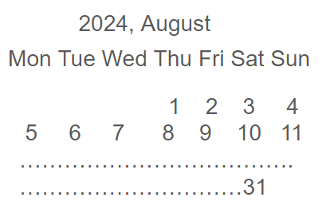

# Stubs for HW 17 definition
## Writing application for printing calendar in the similar view as shown below

## command line takes the follwoing arguments
### arg1 - month number
### arg2 - year number
### If no arguments current month / year are implied